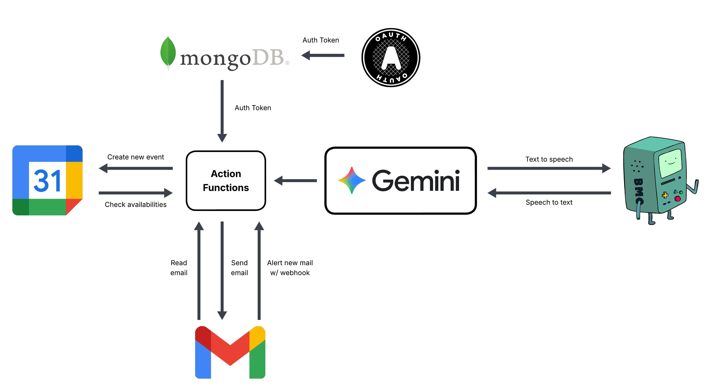

# BMO - Personal Assistent




**BMO** is an **agentic conversational assistant** powered by Google’s Gemini generative AI model. It understands natural language to manage everyday tasks such as reading and sending emails, checking calendar availability, scheduling meetings, and sending follow-up messages. BMO is also integrated with physical hardware, allowing users to talk directly to it for a truly hands-free and voice-driven experience that combines intelligent automation with real-world interaction.

### Run BMO locally
```bash
# in /backend
uvicorn main:app --reload
```
```bash
# in /AI
python agent_api.py
```
create a `.env` file within `/AI` containing your `GEMENI_API_KEY` key and `GOOGLE_ID`.

To talk to BMO without the physical device
```bash
# in /AI
python main.py
```

### Our tech stack
- **FastAPI**: Used to create RESTful APIs for communication between the assistant and external services.
- **Google OAuth 2.0**: Handles user authentication and authorization for accessing Google services like Gmail and Calendar.
- **Google Calendar API**: Used to check availability, schedule meetings, and manage calendar events.
- **Gmail API**: Enables reading, sending, and managing emails programmatically.
- **Google GenAI (Gemini)**: Powers the conversational assistant with generative AI capabilities.
- **MongoDB**: Stores user credentials (e.g., access tokens, refresh tokens) securely for Google API access.